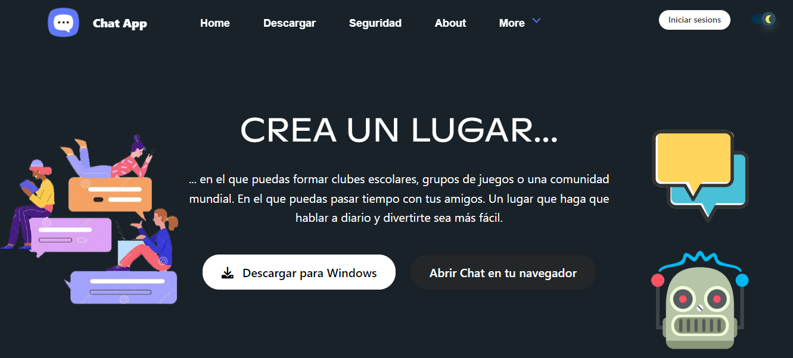

# Chat App Project
## Introduction

Alumno: Andres Rafael Escala Acosta.

Nombre del proyecto: Chat App (nombre provisional).

Este es el repositorio de Chat App para el proyecto de la UA: Ingeniera Web. 

Se utilizó: HTML, CSS, JavaScript y Bulma CSS, para la construccion de la Homepage.

Puede acceder a la Homepage desde: https://escalandres.github.io/IngWebProject/

## Light Theme:

## Dark Theme:

## Agradecimientos:

Este proyecto está inspirado en la UI de Discord. Se da un enorme agradecimiento a Discord por servir como modelo base para el diseño de este proyecto!